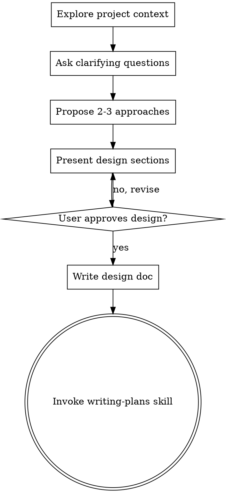

# Мозговой штурм: от идеи к дизайну

## Обзор

Помоги превратить идеи в полностью проработанные дизайны и спецификации через естественный совместный диалог.

Начни с понимания текущего контекста проекта, затем задавай вопросы по одному для уточнения идеи. Как только поймёшь, что строишь — представь дизайн и получи одобрение пользователя.

<HARD-GATE>
НЕ вызывай никакой навык реализации, не пиши код, не создавай каркас проекта и не предпринимай никаких действий по реализации, пока ты не представил дизайн и пользователь его не утвердил. Это относится к КАЖДОМУ проекту вне зависимости от кажущейся простоты.
</HARD-GATE>

## Антипаттерн: «Это слишком просто для дизайна»

Каждый проект проходит через этот процесс. Список задач, утилита из одной функции, изменение конфига — все они. «Простые» проекты — это именно то место, где непроверенные допущения приводят к наибольшей потере времени. Дизайн может быть коротким (пара предложений для действительно простых проектов), но ты ОБЯЗАН его представить и получить одобрение.

## Чеклист

Ты ОБЯЗАН создать задачу для каждого из этих пунктов и выполнить их по порядку:

1. **Изучи контекст проекта** — проверь файлы, документацию, последние commit'ы
2. **Задай уточняющие вопросы** — по одному за раз, пойми цель/ограничения/критерии успеха
3. **Предложи 2-3 подхода** — с компромиссами и своей рекомендацией
4. **Представь дизайн** — в секциях, масштабированных по сложности, получи одобрение пользователя после каждой секции
5. **Напиши документ дизайна** — сохрани в `docs/plans/YYYY-MM-DD-<topic>-design.md` и сделай commit
6. **Перейди к реализации** — вызови навык writing-plans для создания плана реализации

## Поток процесса

**Конечное состояние — вызов writing-plans.** НЕ вызывай frontend-design, mcp-builder или любой другой навык реализации. ЕДИНСТВЕННЫЙ навык, который ты вызываешь после brainstorming — это writing-plans.

## Процесс

**Понимание идеи:**
- Сначала проверь текущее состояние проекта (файлы, документация, последние commit'ы)
- Задавай вопросы по одному для уточнения идеи
- Предпочитай вопросы с вариантами ответов, но открытые тоже подходят
- Только один вопрос за сообщение — если тема требует дополнительного изучения, разбей на несколько вопросов
- Фокусируйся на понимании: цель, ограничения, критерии успеха

**Исследование подходов:**
- Предложи 2-3 разных подхода с компромиссами
- Представь варианты в разговорном стиле со своей рекомендацией и обоснованием
- Начни с рекомендуемого варианта и объясни почему

**Представление дизайна:**
- Когда считаешь, что понимаешь, что строишь — представь дизайн
- Масштабируй каждую секцию по её сложности: пару предложений для простого, до 200-300 слов для нюансов
- Спрашивай после каждой секции, выглядит ли всё правильно
- Покрой: архитектуру, компоненты, поток данных, обработку ошибок, тестирование
- Будь готов вернуться и уточнить, если что-то не ясно

## После дизайна

**Документация:**
- Запиши утверждённый дизайн в `docs/plans/YYYY-MM-DD-<topic>-design.md`
- Используй навык elements-of-style:writing-clearly-and-concisely, если доступен
- Сделай commit документа дизайна в git

**Реализация:**
- Вызови навык writing-plans для создания детального плана реализации
- НЕ вызывай никакой другой навык. writing-plans — следующий шаг.

## Ключевые принципы

- **Один вопрос за раз** — Не перегружай множественными вопросами
- **Вопросы с вариантами предпочтительнее** — На них проще отвечать, чем на открытые, когда это возможно
- **YAGNI безжалостно** — Убирай ненужные фичи из всех дизайнов
- **Исследуй альтернативы** — Всегда предлагай 2-3 подхода перед выбором
- **Инкрементальная валидация** — Представь дизайн, получи одобрение перед продолжением
- **Будь гибким** — Возвращайся и уточняй, когда что-то не ясно
