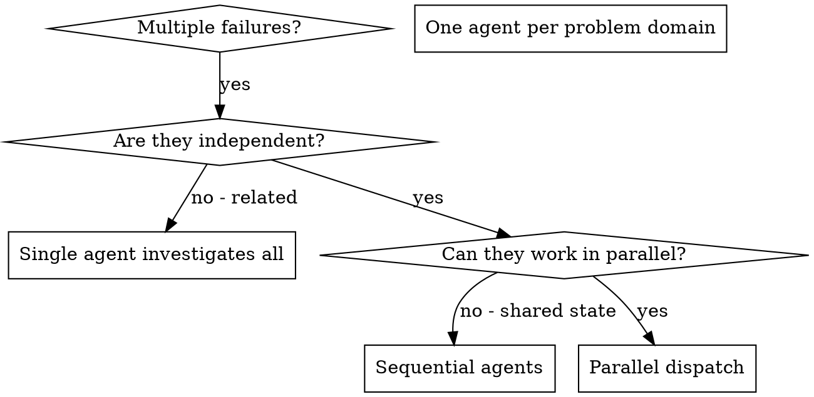

# Распределение параллельных агентов

## Обзор

Когда у вас несколько несвязанных сбоев (разные тестовые файлы, разные подсистемы, разные баги), последовательное расследование каждого — пустая трата времени. Каждое расследование независимо и может выполняться параллельно.

**Ключевой принцип:** Назначайте одного агента на каждую независимую проблемную область. Пусть работают одновременно.

## Когда использовать



**Используйте когда:**
- 3+ тестовых файла падают по разным причинам
- Несколько подсистем сломаны независимо друг от друга
- Каждую проблему можно понять без контекста остальных
- Нет общего состояния между расследованиями

**Не используйте когда:**
- Сбои связаны между собой (исправление одного может исправить остальные)
- Нужно понимание полного состояния системы
- Агенты будут мешать друг другу

## Паттерн

### 1. Определите независимые области

Сгруппируйте сбои по тому, что сломано:
- Файл A тесты: Процесс подтверждения инструментов
- Файл B тесты: Поведение пакетного завершения
- Файл C тесты: Функциональность отмены

Каждая область независима — исправление подтверждения инструментов не влияет на тесты отмены.

### 2. Создайте целевые задачи для агентов

Каждый агент получает:
- **Конкретную область:** Один тестовый файл или подсистема
- **Чёткую цель:** Сделать так, чтобы эти тесты проходили
- **Ограничения:** Не менять другой код
- **Ожидаемый результат:** Сводка найденного и исправленного

### 3. Отправьте параллельно

```typescript
// В окружении Claude Code / AI
Task("Fix agent-tool-abort.test.ts failures")
Task("Fix batch-completion-behavior.test.ts failures")
Task("Fix tool-approval-race-conditions.test.ts failures")
// Все три запускаются одновременно
```

### 4. Проверьте и интегрируйте

Когда агенты вернут результаты:
- Прочитайте каждую сводку
- Убедитесь, что исправления не конфликтуют
- Запустите полный набор тестов
- Интегрируйте все изменения

## Структура промпта агента

Хорошие промпты для агентов:
1. **Сфокусированы** — одна чёткая проблемная область
2. **Самодостаточны** — весь необходимый контекст для понимания проблемы
3. **Конкретны в отношении вывода** — что агент должен вернуть?

```markdown
Fix the 3 failing tests in src/agents/agent-tool-abort.test.ts:

1. "should abort tool with partial output capture" - expects 'interrupted at' in message
2. "should handle mixed completed and aborted tools" - fast tool aborted instead of completed
3. "should properly track pendingToolCount" - expects 3 results but gets 0

These are timing/race condition issues. Your task:

1. Read the test file and understand what each test verifies
2. Identify root cause - timing issues or actual bugs?
3. Fix by:
   - Replacing arbitrary timeouts with event-based waiting
   - Fixing bugs in abort implementation if found
   - Adjusting test expectations if testing changed behavior

Do NOT just increase timeouts - find the real issue.

Return: Summary of what you found and what you fixed.
```

## Типичные ошибки

**❌ Слишком широко:** «Почини все тесты» — агент потеряется
**✅ Конкретно:** «Почини agent-tool-abort.test.ts» — чёткая область

**❌ Без контекста:** «Почини состояние гонки» — агент не знает где
**✅ С контекстом:** Вставьте сообщения об ошибках и названия тестов

**❌ Без ограничений:** Агент может рефакторить всё подряд
**✅ С ограничениями:** «НЕ меняй продакшн-код» или «Исправляй только тесты»

**❌ Неясный результат:** «Почини это» — непонятно, что изменилось
**✅ Конкретный:** «Верни сводку корневой причины и изменений»

## Когда НЕ использовать

**Связанные сбои:** Исправление одного может исправить остальные — сначала исследуйте совместно
**Нужен полный контекст:** Понимание требует видения всей системы
**Исследовательская отладка:** Вы ещё не знаете, что сломано
**Общее состояние:** Агенты будут мешать друг другу (редактируют одни файлы, используют одни ресурсы)

## Реальный пример из сессии

**Сценарий:** 6 падений тестов в 3 файлах после крупного refactoring

**Сбои:**
- agent-tool-abort.test.ts: 3 падения (проблемы с таймингом)
- batch-completion-behavior.test.ts: 2 падения (инструменты не выполняются)
- tool-approval-race-conditions.test.ts: 1 падение (счётчик выполнений = 0)

**Решение:** Независимые области — логика отмены отдельно от пакетного завершения отдельно от состояний гонки

**Распределение:**
```
Агент 1 → Починить agent-tool-abort.test.ts
Агент 2 → Починить batch-completion-behavior.test.ts
Агент 3 → Починить tool-approval-race-conditions.test.ts
```

**Результаты:**
- Агент 1: Заменил таймауты на ожидание на основе событий
- Агент 2: Исправил баг в структуре события (threadId в неправильном месте)
- Агент 3: Добавил ожидание завершения асинхронного выполнения инструмента

**Интеграция:** Все исправления независимы, конфликтов нет, полный набор тестов зелёный

**Сэкономлено времени:** 3 проблемы решены параллельно вместо последовательно

## Ключевые преимущества

1. **Параллелизация** — несколько расследований происходят одновременно
2. **Фокус** — у каждого агента узкая область, меньше контекста для отслеживания
3. **Независимость** — агенты не мешают друг другу
4. **Скорость** — 3 проблемы решены за время одной

## Верификация

После возвращения агентов:
1. **Просмотрите каждую сводку** — поймите, что изменилось
2. **Проверьте на конфликты** — редактировали ли агенты один и тот же код?
3. **Запустите полный набор тестов** — убедитесь, что все исправления работают вместе
4. **Выборочная проверка** — агенты могут допускать систематические ошибки

## Реальный результат

Из сессии отладки (2025-10-03):
- 6 падений в 3 файлах
- 3 агента отправлены параллельно
- Все расследования завершены одновременно
- Все исправления успешно интегрированы
- Ноль конфликтов между изменениями агентов
