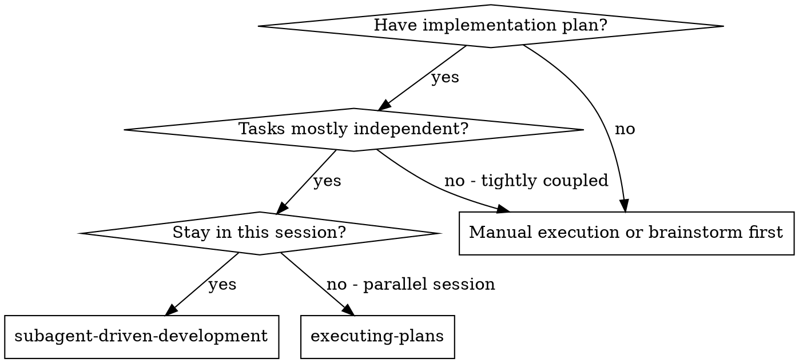
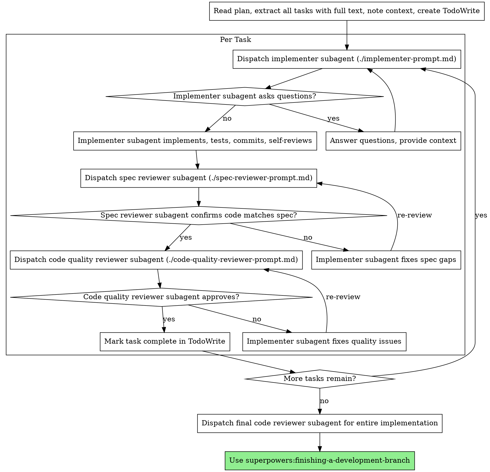

# Subagent-Driven Development

Выполнение плана путём отправки свежего subagent на каждую задачу с двухступенчатым ревью после каждой: сначала проверка соответствия спецификации, затем проверка качества кода.

**Ключевой принцип:** Свежий subagent на задачу + двухступенчатое ревью (спецификация, затем качество) = высокое качество, быстрая итерация

## Когда использовать



**Сравнение с Executing Plans (параллельная сессия):**
- Та же сессия (без переключения контекста)
- Свежий subagent на задачу (без загрязнения контекста)
- Двухступенчатое ревью после каждой задачи: сначала соответствие спецификации, затем качество кода
- Быстрая итерация (без участия человека между задачами)

## Процесс



## Шаблоны промптов

- `./implementer-prompt.md` — отправка subagent-реализатора
- `./spec-reviewer-prompt.md` — отправка subagent-ревьюера соответствия спецификации
- `./code-quality-reviewer-prompt.md` — отправка subagent-ревьюера качества кода

## Пример рабочего процесса

```
Вы: Я использую Subagent-Driven Development для выполнения этого плана.

[Чтение файла плана один раз: docs/plans/feature-plan.md]
[Извлечение всех 5 задач с полным текстом и контекстом]
[Создание TodoWrite со всеми задачами]

Задача 1: Скрипт установки хука

[Получение текста Задачи 1 и контекста (уже извлечено)]
[Отправка subagent реализации с полным текстом задачи + контекстом]

Реализатор: «Прежде чем начну — хук должен устанавливаться на уровне пользователя или системы?»

Вы: «На уровне пользователя (~/.config/superpowers/hooks/)»

Реализатор: «Понял. Реализую...»
[Позже] Реализатор:
  - Реализована команда install-hook
  - Добавлены тесты, 5/5 проходят
  - Саморевью: Обнаружил, что пропустил флаг --force, добавил его
  - Закоммичено

[Отправка ревьюера соответствия спецификации]
Ревьюер спецификации: ✅ Соответствует спецификации — все требования выполнены, ничего лишнего

[Получение git SHA, отправка ревьюера качества кода]
Ревьюер кода: Сильные стороны: Хорошее покрытие тестами, чисто. Проблемы: Нет. Одобрено.

[Отметка Задачи 1 как завершённой]

Задача 2: Режимы восстановления

[Получение текста Задачи 2 и контекста (уже извлечено)]
[Отправка subagent реализации с полным текстом задачи + контекстом]

Реализатор: [Без вопросов, приступает]
Реализатор:
  - Добавлены режимы verify/repair
  - 8/8 тестов проходят
  - Саморевью: Всё хорошо
  - Закоммичено

[Отправка ревьюера соответствия спецификации]
Ревьюер спецификации: ❌ Проблемы:
  - Отсутствует: Отчёт о прогрессе (спецификация говорит «отчёт каждые 100 элементов»)
  - Лишнее: Добавлен флаг --json (не запрашивался)

[Реализатор исправляет проблемы]
Реализатор: Удалил флаг --json, добавил отчёт о прогрессе

[Ревьюер спецификации проверяет снова]
Ревьюер спецификации: ✅ Теперь соответствует спецификации

[Отправка ревьюера качества кода]
Ревьюер кода: Сильные стороны: Надёжно. Проблемы (Important): Магическое число (100)

[Реализатор исправляет]
Реализатор: Вынесена константа PROGRESS_INTERVAL

[Ревьюер кода проверяет снова]
Ревьюер кода: ✅ Одобрено

[Отметка Задачи 2 как завершённой]

...

[После всех задач]
[Отправка финального code-reviewer]
Финальный ревьюер: Все требования выполнены, готово к merge

Готово!
```

## Преимущества

**По сравнению с ручным выполнением:**
- Subagent-ы естественно следуют TDD
- Свежий контекст на каждую задачу (без путаницы)
- Безопасно для параллельной работы (subagent-ы не мешают друг другу)
- Subagent может задавать вопросы (до И во время работы)

**По сравнению с Executing Plans:**
- Та же сессия (без передачи управления)
- Непрерывный прогресс (без ожидания)
- Контрольные точки ревью автоматические

**Повышение эффективности:**
- Нет накладных расходов на чтение файлов (контроллер предоставляет полный текст)
- Контроллер формирует именно тот контекст, который нужен
- Subagent получает полную информацию сразу
- Вопросы выявляются до начала работы (а не после)

**Ворота качества:**
- Саморевью ловит проблемы до передачи
- Двухступенчатое ревью: соответствие спецификации, затем качество кода
- Циклы ревью гарантируют, что исправления действительно работают
- Соответствие спецификации предотвращает избыточную/недостаточную реализацию
- Ревью качества обеспечивает хорошо выполненную реализацию

**Стоимость:**
- Больше вызовов subagent-ов (реализатор + 2 ревьюера на задачу)
- Контроллер делает больше подготовительной работы (извлечение всех задач заранее)
- Циклы ревью добавляют итерации
- Но проблемы ловятся рано (дешевле, чем отладка потом)

## Красные флаги

**Никогда:**
- Начинать реализацию на ветке main/master без явного согласия пользователя
- Пропускать ревью (соответствие спецификации ИЛИ качество кода)
- Продолжать с неисправленными проблемами
- Отправлять несколько subagent-ов реализации параллельно (конфликты)
- Заставлять subagent читать файл плана (предоставьте полный текст)
- Пропускать контекст сцены (subagent должен понимать, где задача вписывается)
- Игнорировать вопросы subagent-а (ответьте, прежде чем позволить продолжить)
- Принимать «достаточно близко» по соответствию спецификации (ревьюер нашёл проблемы = не готово)
- Пропускать циклы ревью (ревьюер нашёл проблемы = реализатор исправляет = ревью снова)
- Позволять саморевью реализатора заменять настоящее ревью (нужно и то, и другое)
- **Начинать ревью качества кода до того, как соответствие спецификации ✅** (неправильный порядок)
- Переходить к следующей задаче, пока у любого ревью есть открытые проблемы

**Если subagent задаёт вопросы:**
- Отвечайте чётко и полно
- Предоставьте дополнительный контекст при необходимости
- Не торопите с реализацией

**Если ревьюер находит проблемы:**
- Реализатор (тот же subagent) исправляет их
- Ревьюер проверяет снова
- Повторять до одобрения
- Не пропускайте повторное ревью

**Если subagent не справился с задачей:**
- Отправьте subagent исправления с конкретными инструкциями
- Не пытайтесь исправить вручную (загрязнение контекста)

## Интеграция

**Необходимые навыки рабочего процесса:**
- **superpowers:using-git-worktrees** — ОБЯЗАТЕЛЬНО: Настройка изолированного рабочего пространства перед началом
- **superpowers:writing-plans** — Создаёт план, который выполняет данный навык
- **superpowers:requesting-code-review** — Шаблон код-ревью для subagent-ов-ревьюеров
- **superpowers:finishing-a-development-branch** — Завершение разработки после всех задач

**Subagent-ы должны использовать:**
- **superpowers:test-driven-development** — Subagent-ы следуют TDD для каждой задачи

**Альтернативный рабочий процесс:**
- **superpowers:executing-plans** — Используйте для параллельной сессии вместо выполнения в той же сессии
