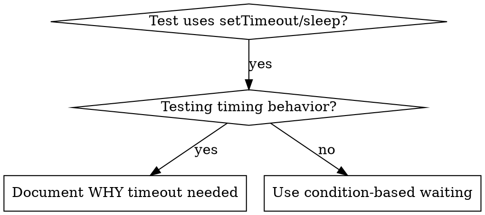

# Ожидание на основе условий

## Обзор

Нестабильные тесты часто угадывают тайминги произвольными задержками. Это создаёт состояния гонки, при которых тесты проходят на быстрых машинах, но падают под нагрузкой или в CI.

**Основной принцип:** Ожидайте реального условия, которое вас интересует, а не гадайте, сколько времени оно займёт.

## Когда использовать



**Используйте когда:**
- Тесты содержат произвольные задержки (`setTimeout`, `sleep`, `time.sleep()`)
- Тесты нестабильны (иногда проходят, иногда падают под нагрузкой)
- Тесты вылетают по таймауту при параллельном запуске
- Ожидание завершения асинхронных операций

**Не используйте когда:**
- Тестируется реальное поведение по времени (debounce, интервалы throttle)
- Всегда документируйте ПОЧЕМУ, если используете произвольный таймаут

## Базовый паттерн

```typescript
// ❌ ДО: Угадываем тайминг
await new Promise(r => setTimeout(r, 50));
const result = getResult();
expect(result).toBeDefined();

// ✅ ПОСЛЕ: Ждём условия
await waitFor(() => getResult() !== undefined);
const result = getResult();
expect(result).toBeDefined();
```

## Быстрые паттерны

| Сценарий | Паттерн |
|----------|---------|
| Ожидание события | `waitFor(() => events.find(e => e.type === 'DONE'))` |
| Ожидание состояния | `waitFor(() => machine.state === 'ready')` |
| Ожидание количества | `waitFor(() => items.length >= 5)` |
| Ожидание файла | `waitFor(() => fs.existsSync(path))` |
| Сложное условие | `waitFor(() => obj.ready && obj.value > 10)` |

## Реализация

Универсальная функция опроса:
```typescript
async function waitFor<T>(
  condition: () => T | undefined | null | false,
  description: string,
  timeoutMs = 5000
): Promise<T> {
  const startTime = Date.now();

  while (true) {
    const result = condition();
    if (result) return result;

    if (Date.now() - startTime > timeoutMs) {
      throw new Error(`Timeout waiting for ${description} after ${timeoutMs}ms`);
    }

    await new Promise(r => setTimeout(r, 10)); // Опрос каждые 10мс
  }
}
```

Смотрите `condition-based-waiting-example.ts` в этой директории — полная реализация с доменно-специфичными хелперами (`waitForEvent`, `waitForEventCount`, `waitForEventMatch`) из реальной сессии отладки.

## Частые ошибки

**❌ Слишком частый опрос:** `setTimeout(check, 1)` — тратит CPU
**✅ Исправление:** Опрашивайте каждые 10мс

**❌ Нет таймаута:** Бесконечный цикл, если условие никогда не выполнится
**✅ Исправление:** Всегда включайте таймаут с понятным сообщением об ошибке

**❌ Устаревшие данные:** Кэширование состояния до цикла
**✅ Исправление:** Вызывайте геттер внутри цикла для получения свежих данных

## Когда произвольный таймаут ДОПУСТИМ

```typescript
// Инструмент тикает каждые 100мс — нужно 2 тика для проверки частичного вывода
await waitForEvent(manager, 'TOOL_STARTED'); // Сначала: ждём условие
await new Promise(r => setTimeout(r, 200));   // Потом: ждём поведение по времени
// 200мс = 2 тика по 100мс — задокументировано и обосновано
```

**Требования:**
1. Сначала дождитесь срабатывания условия
2. Основано на известных таймингах (не на угадывании)
3. Комментарий, объясняющий ПОЧЕМУ

## Реальное влияние

Из сессии отладки (2025-10-03):
- Исправлено 15 нестабильных тестов в 3 файлах
- Процент прохождения: 60% → 100%
- Время выполнения: на 40% быстрее
- Больше никаких состояний гонки
