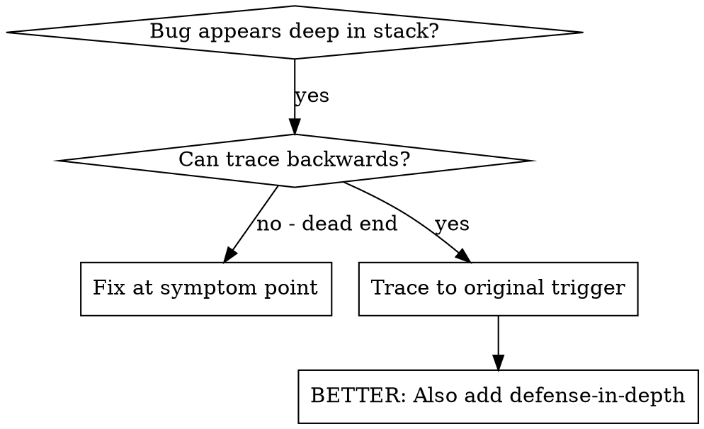
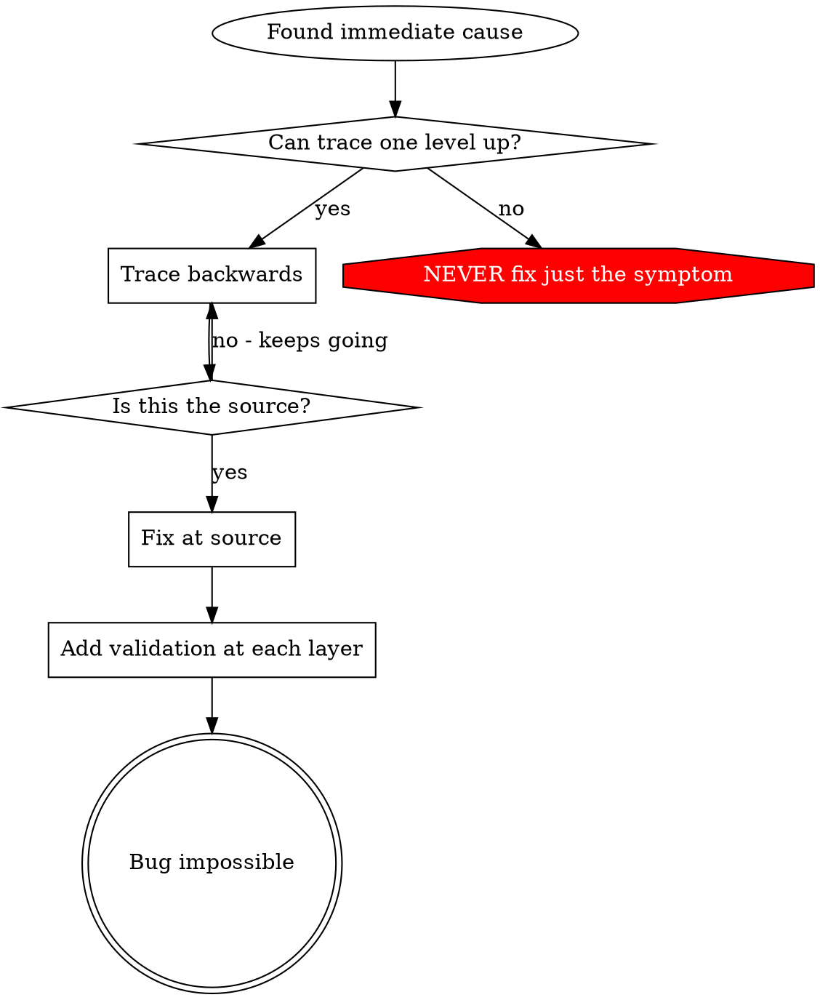

# Отслеживание первопричины

## Обзор

Баги часто проявляются глубоко в стеке вызовов (git init в неправильной директории, файл создан не там, база данных открыта по неверному пути). Инстинкт подсказывает исправить там, где ошибка проявляется, но это лечение симптома.

**Основной принцип:** Прослеживайте назад по цепочке вызовов, пока не найдёте исходный триггер, затем исправляйте у источника.

## Когда использовать



**Используйте когда:**
- Ошибка возникает глубоко в выполнении (не на точке входа)
- Стек-трейс показывает длинную цепочку вызовов
- Неясно, откуда появились невалидные данные
- Нужно найти, какой тест/код вызывает проблему

## Процесс отслеживания

### 1. Наблюдение симптома
```
Error: git init failed in /Users/jesse/project/packages/core
```

### 2. Поиск непосредственной причины
**Какой код напрямую вызывает это?**
```typescript
await execFileAsync('git', ['init'], { cwd: projectDir });
```

### 3. Вопрос: Что вызвало это?
```typescript
WorktreeManager.createSessionWorktree(projectDir, sessionId)
  → вызвано из Session.initializeWorkspace()
  → вызвано из Session.create()
  → вызвано из теста в Project.create()
```

### 4. Продолжаем отслеживание вверх
**Какое значение было передано?**
- `projectDir = ''` (пустая строка!)
- Пустая строка в качестве `cwd` резолвится в `process.cwd()`
- А это директория исходного кода!

### 5. Находим исходный триггер
**Откуда взялась пустая строка?**
```typescript
const context = setupCoreTest(); // Возвращает { tempDir: '' }
Project.create('name', context.tempDir); // Обращение до beforeEach!
```

## Добавление стек-трейсов

Когда не удаётся отследить вручную, добавьте инструментацию:

```typescript
// Перед проблемной операцией
async function gitInit(directory: string) {
  const stack = new Error().stack;
  console.error('DEBUG git init:', {
    directory,
    cwd: process.cwd(),
    nodeEnv: process.env.NODE_ENV,
    stack,
  });

  await execFileAsync('git', ['init'], { cwd: directory });
}
```

**Важно:** Используйте `console.error()` в тестах (не логгер — может не показать)

**Запустите и перехватите:**
```bash
npm test 2>&1 | grep 'DEBUG git init'
```

**Анализируйте стек-трейсы:**
- Ищите имена тестовых файлов
- Найдите номер строки, инициирующей вызов
- Выявите паттерн (один и тот же тест? один и тот же параметр?)

## Поиск теста, загрязняющего среду

Если что-то появляется во время тестов, но непонятно, какой тест виноват:

Используйте скрипт бисекции `find-polluter.sh` в этой директории:

```bash
./find-polluter.sh '.git' 'src/**/*.test.ts'
```

Запускает тесты по одному, останавливается на первом загрязнителе. Подробности — в скрипте.

## Реальный пример: пустой projectDir

**Симптом:** `.git` создаётся в `packages/core/` (исходный код)

**Цепочка отслеживания:**
1. `git init` выполняется в `process.cwd()` ← пустой параметр cwd
2. WorktreeManager вызван с пустым projectDir
3. Session.create() передала пустую строку
4. Тест обратился к `context.tempDir` до beforeEach
5. setupCoreTest() изначально возвращает `{ tempDir: '' }`

**Первопричина:** Инициализация переменной верхнего уровня, обращающейся к пустому значению

**Исправление:** Сделали tempDir геттером, который выбрасывает ошибку при обращении до beforeEach

**Также добавлена эшелонированная защита:**
- Уровень 1: Project.create() валидирует директорию
- Уровень 2: WorkspaceManager валидирует непустоту
- Уровень 3: Защита NODE_ENV запрещает git init за пределами tmpdir
- Уровень 4: Логирование стек-трейса перед git init

## Ключевой принцип



**НИКОГДА не исправляйте только там, где ошибка проявляется.** Отследите назад и найдите исходный триггер.

## Советы по стек-трейсам

**В тестах:** Используйте `console.error()`, а не логгер — логгер может быть подавлен
**Перед операцией:** Логируйте до опасной операции, а не после её падения
**Включайте контекст:** Директорию, cwd, переменные окружения, временные метки
**Захватывайте стек:** `new Error().stack` показывает полную цепочку вызовов

## Реальное влияние

Из сессии отладки (2025-10-03):
- Первопричина найдена через отслеживание 5 уровней
- Исправлено у источника (валидация геттером)
- Добавлено 4 уровня защиты
- 1847 тестов прошли, ноль загрязнений
