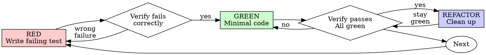

# Разработка через тестирование (TDD)

## Обзор

Сначала напиши тест. Убедись, что он падает. Напиши минимальный код, чтобы тест прошёл.

**Основной принцип:** Если ты не видел, как тест падает — ты не знаешь, тестирует ли он правильную вещь.

**Нарушение буквы правил — это нарушение духа правил.**

## Когда использовать

**Всегда:**
- Новые фичи
- Исправление багов
- Refactoring
- Изменение поведения

**Исключения (спроси своего партнёра-человека):**
- Одноразовые прототипы
- Сгенерированный код
- Конфигурационные файлы

Думаешь «пропущу TDD только в этот раз»? Стоп. Это рационализация.

## Железный закон

```
NO PRODUCTION CODE WITHOUT A FAILING TEST FIRST
```

Написал код до теста? Удали его. Начни заново.

**Без исключений:**
- Не храни его «для справки»
- Не «адаптируй» его при написании тестов
- Не смотри на него
- Удалить значит удалить

Реализуй заново из тестов. Точка.

## Красный-Зелёный-Рефакторинг



### КРАСНЫЙ — Напиши падающий тест

Напиши один минимальный тест, показывающий, что должно происходить.

<Good>
```typescript
test('retries failed operations 3 times', async () => {
  let attempts = 0;
  const operation = () => {
    attempts++;
    if (attempts < 3) throw new Error('fail');
    return 'success';
  };

  const result = await retryOperation(operation);

  expect(result).toBe('success');
  expect(attempts).toBe(3);
});
```
Понятное имя, тестирует реальное поведение, одна вещь
</Good>

<Bad>
```typescript
test('retry works', async () => {
  const mock = jest.fn()
    .mockRejectedValueOnce(new Error())
    .mockRejectedValueOnce(new Error())
    .mockResolvedValueOnce('success');
  await retryOperation(mock);
  expect(mock).toHaveBeenCalledTimes(3);
});
```
Размытое имя, тестирует мок вместо кода
</Bad>

**Требования:**
- Одно поведение
- Понятное имя
- Реальный код (моки только если неизбежно)

### Проверка КРАСНОГО — Убедись, что падает

**ОБЯЗАТЕЛЬНО. Никогда не пропускай.**

```bash
npm test path/to/test.test.ts
```

Проверь:
- Тест падает (не ошибка выполнения)
- Сообщение об ошибке ожидаемое
- Падает потому что фича отсутствует (не опечатки)

**Тест проходит?** Ты тестируешь существующее поведение. Исправь тест.

**Тест выдаёт ошибку выполнения?** Исправь ошибку, перезапусти пока не начнёт правильно падать.

### ЗЕЛЁНЫЙ — Минимальный код

Напиши простейший код, чтобы тест прошёл.

<Good>
```typescript
async function retryOperation<T>(fn: () => Promise<T>): Promise<T> {
  for (let i = 0; i < 3; i++) {
    try {
      return await fn();
    } catch (e) {
      if (i === 2) throw e;
    }
  }
  throw new Error('unreachable');
}
```
Ровно столько, сколько нужно для прохождения
</Good>

<Bad>
```typescript
async function retryOperation<T>(
  fn: () => Promise<T>,
  options?: {
    maxRetries?: number;
    backoff?: 'linear' | 'exponential';
    onRetry?: (attempt: number) => void;
  }
): Promise<T> {
  // YAGNI
}
```
Переусложнение
</Bad>

Не добавляй фичи, не рефактори другой код и не «улучшай» за пределами теста.

### Проверка ЗЕЛЁНОГО — Убедись, что проходит

**ОБЯЗАТЕЛЬНО.**

```bash
npm test path/to/test.test.ts
```

Проверь:
- Тест проходит
- Остальные тесты по-прежнему проходят
- Вывод чистый (нет ошибок, предупреждений)

**Тест падает?** Исправь код, не тест.

**Другие тесты падают?** Исправь сейчас.

### РЕФАКТОРИНГ — Наведи порядок

Только после зелёного:
- Убери дублирование
- Улучши имена
- Выдели хелперы

Тесты остаются зелёными. Не добавляй поведение.

### Повтори

Следующий падающий тест для следующей фичи.

## Хорошие тесты

| Качество | Хорошо | Плохо |
|----------|--------|-------|
| **Минимальный** | Одна вещь. «и» в имени? Разбей. | `test('validates email and domain and whitespace')` |
| **Понятный** | Имя описывает поведение | `test('test1')` |
| **Показывает намерение** | Демонстрирует желаемый API | Скрывает, что код должен делать |

## Почему порядок важен

**«Я напишу тесты потом, чтобы проверить работоспособность»**

Тесты, написанные после кода, сразу проходят. Немедленное прохождение ничего не доказывает:
- Может тестировать не то
- Может тестировать реализацию, а не поведение
- Может пропустить крайние случаи, которые ты забыл
- Ты никогда не видел, как тест ловит баг

Написание тестов первыми заставляет тебя увидеть падение теста, доказывая, что он действительно что-то тестирует.

**«Я уже вручную проверил все крайние случаи»**

Ручное тестирование — это бессистемно. Ты думаешь, что проверил всё, но:
- Нет записей о том, что ты проверил
- Нельзя перезапустить при изменении кода
- Легко забыть случаи под давлением
- «Работало, когда я пробовал» ≠ исчерпывающая проверка

Автоматизированные тесты систематичны. Они работают одинаково каждый раз.

**«Удалять X часов работы — расточительно»**

Ошибка невозвратных затрат. Время уже потеряно. Твой выбор сейчас:
- Удалить и переписать с TDD (ещё X часов, высокая уверенность)
- Оставить и добавить тесты потом (30 минут, низкая уверенность, вероятные баги)

«Расточительство» — это хранение кода, которому нельзя доверять. Работающий код без реальных тестов — это технический долг.

**«TDD — это догматизм, прагматизм означает адаптацию»**

TDD — ЭТО прагматизм:
- Находит баги до commit'а (быстрее, чем отладка после)
- Предотвращает регрессии (тесты сразу ловят поломки)
- Документирует поведение (тесты показывают, как использовать код)
- Позволяет рефакторить (меняй свободно, тесты поймают поломки)

«Прагматичные» срезания углов = отладка на продакшене = медленнее.

**«Тесты после достигают тех же целей — важен дух, а не ритуал»**

Нет. Тесты-после отвечают на «Что это делает?» Тесты-до отвечают на «Что это должно делать?»

Тесты-после предвзяты из-за твоей реализации. Ты тестируешь то, что построил, а не то, что требуется. Ты проверяешь запомненные крайние случаи, а не обнаруженные.

Тесты-до заставляют обнаруживать крайние случаи до реализации. Тесты-после проверяют, что ты всё запомнил (ты не запомнил).

30 минут тестов после ≠ TDD. Ты получаешь покрытие, теряешь доказательство работы тестов.

## Типичные рационализации

| Отговорка | Реальность |
|-----------|------------|
| «Слишком просто для тестов» | Простой код ломается. Тест занимает 30 секунд. |
| «Напишу тесты потом» | Тесты, проходящие сразу, ничего не доказывают. |
| «Тесты после достигают тех же целей» | Тесты-после = «что это делает?» Тесты-до = «что это должно делать?» |
| «Уже проверил вручную» | Бессистемно ≠ систематично. Нет записей, нельзя перезапустить. |
| «Удалять X часов — расточительно» | Ошибка невозвратных затрат. Хранение непроверенного кода — технический долг. |
| «Оставлю для справки, тесты напишу первыми» | Ты адаптируешь его. Это тестирование после. Удалить значит удалить. |
| «Нужно сначала исследовать» | Нормально. Выброси исследование, начни с TDD. |
| «Тест сложно написать = дизайн неясен» | Слушай тест. Сложно тестировать = сложно использовать. |
| «TDD замедлит меня» | TDD быстрее отладки. Прагматизм = тесты-до. |
| «Ручной тест быстрее» | Ручной тест не доказывает крайние случаи. Ты будешь тестировать заново при каждом изменении. |
| «В существующем коде нет тестов» | Ты его улучшаешь. Добавь тесты к существующему коду. |

## Тревожные сигналы — СТОП и начни заново

- Код до теста
- Тест после реализации
- Тест сразу проходит
- Не можешь объяснить, почему тест упал
- Тесты добавлены «потом»
- Рационализация «только в этот раз»
- «Я уже вручную проверил»
- «Тесты после достигают той же цели»
- «Важен дух, а не ритуал»
- «Оставлю для справки» или «адаптирую существующий код»
- «Уже потратил X часов, удалять — расточительно»
- «TDD — догматизм, я действую прагматично»
- «Это другой случай, потому что...»

**Всё это означает: Удали код. Начни заново с TDD.**

## Пример: Исправление бага

**Баг:** Принимается пустой email

**КРАСНЫЙ**
```typescript
test('rejects empty email', async () => {
  const result = await submitForm({ email: '' });
  expect(result.error).toBe('Email required');
});
```

**Проверка КРАСНОГО**
```bash
$ npm test
FAIL: expected 'Email required', got undefined
```

**ЗЕЛЁНЫЙ**
```typescript
function submitForm(data: FormData) {
  if (!data.email?.trim()) {
    return { error: 'Email required' };
  }
  // ...
}
```

**Проверка ЗЕЛЁНОГО**
```bash
$ npm test
PASS
```

**РЕФАКТОРИНГ**
Выдели валидацию для нескольких полей, если нужно.

## Чеклист верификации

Перед тем как отметить работу завершённой:

- [ ] Каждая новая функция/метод имеет тест
- [ ] Видел падение каждого теста перед реализацией
- [ ] Каждый тест падал по ожидаемой причине (фича отсутствует, не опечатка)
- [ ] Написал минимальный код для прохождения каждого теста
- [ ] Все тесты проходят
- [ ] Вывод чистый (нет ошибок, предупреждений)
- [ ] Тесты используют реальный код (моки только если неизбежно)
- [ ] Крайние случаи и ошибки покрыты

Не можешь отметить все пункты? Ты пропустил TDD. Начни заново.

## Когда застрял

| Проблема | Решение |
|----------|---------|
| Не знаю, как тестировать | Напиши желаемый API. Напиши сначала утверждение. Спроси партнёра-человека. |
| Тест слишком сложный | Дизайн слишком сложный. Упрости интерфейс. |
| Нужно всё мокать | Код слишком связан. Используй внедрение зависимостей. |
| Подготовка теста огромная | Выдели хелперы. Всё ещё сложно? Упрости дизайн. |

## Интеграция с отладкой

Нашёл баг? Напиши падающий тест, воспроизводящий его. Следуй циклу TDD. Тест доказывает исправление и предотвращает регрессию.

Никогда не исправляй баги без теста.

## Антипаттерны тестирования

При добавлении моков или тестовых утилит прочитай @testing-anti-patterns.md, чтобы избежать типичных ошибок:
- Тестирование поведения мока вместо реального поведения
- Добавление методов только для тестов в продакшен-классы
- Использование моков без понимания зависимостей

## Финальное правило

```
Production code → test exists and failed first
Otherwise → not TDD
```

Никаких исключений без разрешения партнёра-человека.
