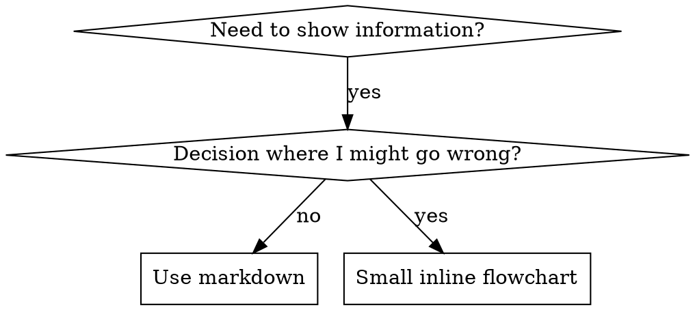

# Написание навыков

## Обзор

**Написание навыков — это Test-Driven Development, применённое к документации процессов.**

**Личные навыки хранятся в директориях, специфичных для агента (`~/.claude/skills` для Claude Code, `~/.agents/skills/` для Codex)**

Вы пишете тест-кейсы (сценарии давления с subagent-ами), наблюдаете за их провалом (базовое поведение), пишете навык (документацию), наблюдаете за прохождением тестов (агенты следуют правилам) и рефакторите (закрываете лазейки).

**Ключевой принцип:** Если вы не наблюдали, как агент проваливается без навыка, вы не знаете, учит ли навык правильному.

**НЕОБХОДИМАЯ БАЗА:** Вы ОБЯЗАНЫ понимать superpowers:test-driven-development перед использованием этого навыка. Тот навык определяет фундаментальный цикл RED-GREEN-REFACTOR. Этот навык адаптирует TDD к документации.

**Официальное руководство:** Для официальных лучших практик Anthropic по созданию навыков смотрите anthropic-best-practices.md. Этот документ содержит дополнительные паттерны и рекомендации, дополняющие TDD-подход этого навыка.

## Что такое навык?

**Навык** — это справочное руководство по проверенным техникам, паттернам или инструментам. Навыки помогают будущим экземплярам Claude находить и применять эффективные подходы.

**Навыки — это:** Переиспользуемые техники, паттерны, инструменты, справочные руководства

**Навыки — это НЕ:** Истории о том, как вы однажды решили проблему

## Соответствие TDD для навыков

| Концепция TDD | Создание навыка |
|---------------|-----------------|
| **Тест-кейс** | Сценарий давления с subagent-ом |
| **Продакшн-код** | Документ навыка (SKILL.md) |
| **Тест падает (RED)** | Агент нарушает правило без навыка (базовое поведение) |
| **Тест проходит (GREEN)** | Агент следует навыку при его наличии |
| **Рефакторинг** | Закрытие лазеек с сохранением соответствия |
| **Сначала тест** | Запустите базовый сценарий ДО написания навыка |
| **Наблюдайте за провалом** | Зафиксируйте точные рационализации агента |
| **Минимальный код** | Напишите навык, адресующий те конкретные нарушения |
| **Наблюдайте за прохождением** | Убедитесь, что агент теперь следует |
| **Цикл рефакторинга** | Найти новые рационализации → заткнуть → перепроверить |

Весь процесс создания навыка следует циклу RED-GREEN-REFACTOR.

## Когда создавать навык

**Создавайте когда:**
- Техника не была для вас интуитивно очевидной
- Вы будете ссылаться на это снова в других проектах
- Паттерн применим широко (не специфичен для проекта)
- Другие выиграют от этого

**Не создавайте для:**
- Одноразовых решений
- Стандартных практик, хорошо документированных в других местах
- Соглашений проекта (поместите в CLAUDE.md)
- Механических ограничений (если можно обеспечить regex/валидацией, автоматизируйте — документацию сохраняйте для решений, требующих суждения)

## Типы навыков

### Техника
Конкретный метод с шагами (condition-based-waiting, root-cause-tracing)

### Паттерн
Способ мышления о проблемах (flatten-with-flags, test-invariants)

### Справочник
Документация API, синтаксические руководства, документация инструментов (office docs)

## Структура директорий


```
skills/
  skill-name/
    SKILL.md              # Основной справочник (обязательно)
    supporting-file.*     # Только если необходимо
```

**Плоское пространство имён** — все навыки в одном пространстве с возможностью поиска

**Отдельные файлы для:**
1. **Объёмных справочников** (100+ строк) — документация API, полный синтаксис
2. **Переиспользуемых инструментов** — Скрипты, утилиты, шаблоны

**Оставляйте инлайн:**
- Принципы и концепции
- Паттерны кода (< 50 строк)
- Всё остальное

## Структура SKILL.md

**Frontmatter (YAML):**
- Поддерживаются только два поля: `name` и `description`
- Максимум 1024 символов в сумме
- `name`: Используйте только буквы, цифры и дефисы (без скобок, спецсимволов)
- `description`: От третьего лица, описывает ТОЛЬКО когда использовать (НЕ что он делает)
  - Начинайте с «Use when...» для фокуса на условиях срабатывания
  - Включайте конкретные симптомы, ситуации и контексты
  - **НИКОГДА не описывайте процесс или рабочий поток навыка** (см. раздел CSO для объяснения)
  - Старайтесь уложиться в 500 символов

```markdown
---
name: Skill-Name-With-Hyphens
description: Use when [конкретные условия и симптомы срабатывания]
---

# Название навыка

## Обзор
Что это? Ключевой принцип в 1-2 предложениях.

## Когда использовать
[Небольшая инлайн-блок-схема ЕСЛИ решение неочевидно]

Список с СИМПТОМАМИ и вариантами использования
Когда НЕ использовать

## Основной паттерн (для техник/паттернов)
Сравнение до/после в коде

## Краткий справочник
Таблица или списки для быстрого сканирования типичных операций

## Реализация
Инлайн-код для простых паттернов
Ссылка на файл для объёмных справочников или переиспользуемых инструментов

## Типичные ошибки
Что идёт не так + исправления

## Реальный результат (опционально)
Конкретные результаты
```


## Claude Search Optimization (CSO)

**Критично для обнаружения:** Будущему Claude нужно НАЙТИ ваш навык

### 1. Богатое поле Description

**Цель:** Claude читает description, чтобы решить, какие навыки загрузить для данной задачи. Оно должно отвечать на вопрос: «Нужно ли мне прочитать этот навык прямо сейчас?»

**Формат:** Начинайте с «Use when...» для фокуса на условиях срабатывания

**КРИТИЧНО: Description = Когда использовать, НЕ Что навык делает**

Description должен ТОЛЬКО описывать условия срабатывания. НЕ описывайте процесс или рабочий поток навыка в description.

**Почему это важно:** Тестирование показало, что когда description описывает рабочий поток навыка, Claude может следовать description вместо того, чтобы читать полное содержание навыка. Description «код-ревью между задачами» приводил к тому, что Claude делал ОДНО ревью, хотя блок-схема навыка чётко показывала ДВА ревью (соответствие спецификации, затем качество кода).

Когда description был изменён на просто «Use when executing implementation plans with independent tasks» (без описания рабочего потока), Claude корректно читал блок-схему и следовал двухступенчатому процессу ревью.

**Ловушка:** Description, описывающие рабочий поток, создают сокращённый путь, которым Claude воспользуется. Тело навыка становится документацией, которую Claude пропускает.

```yaml
# ❌ ПЛОХО: Описывает рабочий поток — Claude может следовать этому вместо чтения навыка
description: Use when executing plans - dispatches subagent per task with code review between tasks

# ❌ ПЛОХО: Слишком много деталей процесса
description: Use for TDD - write test first, watch it fail, write minimal code, refactor

# ✅ ХОРОШО: Только условия срабатывания, без описания рабочего потока
description: Use when executing implementation plans with independent tasks in the current session

# ✅ ХОРОШО: Только условия срабатывания
description: Use when implementing any feature or bugfix, before writing implementation code
```

**Содержание:**
- Используйте конкретные триггеры, симптомы и ситуации, сигнализирующие о применимости навыка
- Описывайте *проблему* (состояния гонки, непоследовательное поведение), а не *языковые симптомы* (setTimeout, sleep)
- Формулируйте триггеры технологически-нейтрально, если сам навык не специфичен для технологии
- Если навык специфичен для технологии, укажите это явно в триггере
- Пишите от третьего лица (внедряется в системный промпт)
- **НИКОГДА не описывайте процесс или рабочий поток навыка**

```yaml
# ❌ ПЛОХО: Слишком абстрактно, расплывчато, не содержит когда использовать
description: For async testing

# ❌ ПЛОХО: От первого лица
description: I can help you with async tests when they're flaky

# ❌ ПЛОХО: Упоминает технологию, но навык не специфичен для неё
description: Use when tests use setTimeout/sleep and are flaky

# ✅ ХОРОШО: Начинается с «Use when», описывает проблему, без рабочего потока
description: Use when tests have race conditions, timing dependencies, or pass/fail inconsistently

# ✅ ХОРОШО: Технологически-специфичный навык с явным триггером
description: Use when using React Router and handling authentication redirects
```

### 2. Покрытие ключевыми словами

Используйте слова, которые Claude будет искать:
- Сообщения об ошибках: «Hook timed out», «ENOTEMPTY», «race condition»
- Симптомы: «flaky», «hanging», «zombie», «pollution»
- Синонимы: «timeout/hang/freeze», «cleanup/teardown/afterEach»
- Инструменты: Реальные команды, названия библиотек, типы файлов

### 3. Описательные имена

**Используйте активный залог, глагол первым:**
- ✅ `creating-skills` а не `skill-creation`
- ✅ `condition-based-waiting` а не `async-test-helpers`

### 4. Экономия токенов (критично)

**Проблема:** Навыки getting-started и часто-используемые загружаются в КАЖДЫЙ диалог. Каждый токен на счету.

**Целевые объёмы:**
- Рабочие процессы getting-started: <150 слов каждый
- Часто-загружаемые навыки: <200 слов всего
- Остальные навыки: <500 слов (всё равно будьте лаконичны)

**Техники:**

**Переносите детали в справку инструмента:**
```bash
# ❌ ПЛОХО: Документировать все флаги в SKILL.md
search-conversations supports --text, --both, --after DATE, --before DATE, --limit N

# ✅ ХОРОШО: Ссылка на --help
search-conversations supports multiple modes and filters. Run --help for details.
```

**Используйте перекрёстные ссылки:**
```markdown
# ❌ ПЛОХО: Повторять детали рабочего процесса
When searching, dispatch subagent with template...
[20 строк повторяющихся инструкций]

# ✅ ХОРОШО: Ссылка на другой навык
Always use subagents (50-100x context savings). REQUIRED: Use [other-skill-name] for workflow.
```

**Сжимайте примеры:**
```markdown
# ❌ ПЛОХО: Развёрнутый пример (42 слова)
your human partner: "How did we handle authentication errors in React Router before?"
You: I'll search past conversations for React Router authentication patterns.
[Dispatch subagent with search query: "React Router authentication error handling 401"]

# ✅ ХОРОШО: Минимальный пример (20 слов)
Partner: "How did we handle auth errors in React Router?"
You: Searching...
[Dispatch subagent → synthesis]
```

**Устраняйте избыточность:**
- Не повторяйте то, что есть в ссылочных навыках
- Не объясняйте то, что очевидно из команды
- Не включайте несколько примеров одного паттерна

**Проверка:**
```bash
wc -w skills/path/SKILL.md
# рабочие процессы getting-started: стремиться к <150 каждый
# другие часто-загружаемые: стремиться к <200 всего
```

**Называйте по действию или ключевой идее:**
- ✅ `condition-based-waiting` > `async-test-helpers`
- ✅ `using-skills` а не `skill-usage`
- ✅ `flatten-with-flags` > `data-structure-refactoring`
- ✅ `root-cause-tracing` > `debugging-techniques`

**Герундий (-ing) хорошо подходит для процессов:**
- `creating-skills`, `testing-skills`, `debugging-with-logs`
- Активный, описывает действие, которое вы выполняете

### 4. Перекрёстные ссылки на другие навыки

**При написании документации, ссылающейся на другие навыки:**

Используйте только имя навыка с явными маркерами обязательности:
- ✅ Хорошо: `**ОБЯЗАТЕЛЬНЫЙ ПОД-НАВЫК:** Используйте superpowers:test-driven-development`
- ✅ Хорошо: `**НЕОБХОДИМАЯ БАЗА:** Вы ОБЯЗАНЫ понимать superpowers:systematic-debugging`
- ❌ Плохо: `Смотрите skills/testing/test-driven-development` (неясно, обязательно ли)
- ❌ Плохо: `@skills/testing/test-driven-development/SKILL.md` (принудительно загружает, тратит контекст)

**Почему без @ ссылок:** Синтаксис `@` принудительно загружает файлы немедленно, потребляя 200k+ контекста до того, как он понадобится.

## Использование блок-схем



**Используйте блок-схемы ТОЛЬКО для:**
- Неочевидных точек принятия решений
- Циклов процесса, где можно остановиться слишком рано
- Решений «когда использовать A вместо B»

**Никогда не используйте блок-схемы для:**
- Справочных материалов → Таблицы, списки
- Примеров кода → Блоки markdown
- Линейных инструкций → Нумерованные списки
- Меток без семантического смысла (step1, helper2)

Смотрите @graphviz-conventions.dot для правил стиля graphviz.

**Визуализация для напарника:** Используйте `render-graphs.js` в этой директории для рендеринга блок-схем навыка в SVG:
```bash
./render-graphs.js ../some-skill           # Каждая диаграмма отдельно
./render-graphs.js ../some-skill --combine # Все диаграммы в одном SVG
```

## Примеры кода

**Один отличный пример лучше многих посредственных**

Выбирайте наиболее подходящий язык:
- Техники тестирования → TypeScript/JavaScript
- Системная отладка → Shell/Python
- Обработка данных → Python

**Хороший пример:**
- Полный и запускаемый
- С комментариями, объясняющими ПОЧЕМУ
- Из реального сценария
- Чётко показывает паттерн
- Готов к адаптации (не шаблон-заготовка)

**Не надо:**
- Реализовывать на 5+ языках
- Создавать шаблоны для заполнения
- Писать надуманные примеры

Вы хорошо портируете — одного отличного примера достаточно.

## Организация файлов

### Самодостаточный навык
```
defense-in-depth/
  SKILL.md    # Всё инлайн
```
Когда: Всё содержимое помещается, объёмных справочников не нужно

### Навык с переиспользуемым инструментом
```
condition-based-waiting/
  SKILL.md    # Обзор + паттерны
  example.ts  # Рабочие хелперы для адаптации
```
Когда: Инструмент — это переиспользуемый код, а не просто описание

### Навык с объёмным справочником
```
pptx/
  SKILL.md       # Обзор + рабочие процессы
  pptxgenjs.md   # 600 строк справочника API
  ooxml.md       # 500 строк структуры XML
  scripts/       # Исполняемые инструменты
```
Когда: Справочный материал слишком объёмный для инлайн

## Железный закон (тот же, что в TDD)

```
НИКАКОГО НАВЫКА БЕЗ ПАДАЮЩЕГО ТЕСТА СНАЧАЛА
```

Это относится к НОВЫМ навыкам И ПРАВКАМ существующих навыков.

Написали навык до тестирования? Удалите. Начните заново.
Отредактировали навык без тестирования? Такое же нарушение.

**Без исключений:**
- Не для «простых добавлений»
- Не для «просто добавления раздела»
- Не для «обновлений документации»
- Не сохраняйте непротестированные изменения как «справочник»
- Не «адаптируйте» во время запуска тестов
- Удалить значит удалить

**НЕОБХОДИМАЯ БАЗА:** Навык superpowers:test-driven-development объясняет, почему это важно. Те же принципы применяются к документации.

## Тестирование всех типов навыков

Разные типы навыков требуют разных подходов к тестированию:

### Навыки-дисциплины (правила/требования)

**Примеры:** TDD, verification-before-completion, designing-before-coding

**Тестируйте с помощью:**
- Академические вопросы: Понимают ли они правила?
- Сценарии давления: Следуют ли они правилам под давлением?
- Множественные виды давления одновременно: время + невозвратные затраты + усталость
- Выявляйте рационализации и добавляйте явные контрмеры

**Критерий успеха:** Агент следует правилу при максимальном давлении

### Навыки-техники (руководства)

**Примеры:** condition-based-waiting, root-cause-tracing, defensive-programming

**Тестируйте с помощью:**
- Сценарии применения: Могут ли они корректно применить технику?
- Вариативные сценарии: Справляются ли с граничными случаями?
- Тесты с недостающей информацией: Есть ли пробелы в инструкциях?

**Критерий успеха:** Агент успешно применяет технику к новому сценарию

### Навыки-паттерны (ментальные модели)

**Примеры:** reducing-complexity, концепции information-hiding

**Тестируйте с помощью:**
- Сценарии распознавания: Распознают ли они, когда паттерн применим?
- Сценарии применения: Могут ли использовать ментальную модель?
- Контрпримеры: Знают ли, когда НЕ применять?

**Критерий успеха:** Агент корректно определяет когда/как применить паттерн

### Навыки-справочники (документация/API)

**Примеры:** Документация API, справочники команд, руководства по библиотекам

**Тестируйте с помощью:**
- Сценарии поиска: Могут ли найти нужную информацию?
- Сценарии применения: Могут ли корректно использовать найденное?
- Тестирование пробелов: Покрыты ли частые варианты использования?

**Критерий успеха:** Агент находит и корректно применяет справочную информацию

## Типичные рационализации для пропуска тестирования

| Отговорка | Реальность |
|-----------|------------|
| «Навык очевидно ясен» | Ясен для вас ≠ ясен для других агентов. Протестируйте. |
| «Это просто справочник» | Справочники могут иметь пробелы, неясные разделы. Протестируйте поиск. |
| «Тестирование избыточно» | Непротестированные навыки содержат проблемы. Всегда. 15 мин тестирования экономят часы. |
| «Протестирую, если появятся проблемы» | Проблемы = агенты не могут использовать навык. Тестируйте ДО развёртывания. |
| «Слишком утомительно тестировать» | Тестирование менее утомительно, чем отладка плохого навыка в продакшне. |
| «Я уверен, что всё хорошо» | Самоуверенность гарантирует проблемы. Всё равно тестируйте. |
| «Академической проверки достаточно» | Чтение ≠ использование. Тестируйте сценарии применения. |
| «Нет времени тестировать» | Развёртывание непротестированного навыка потратит больше времени на исправления позже. |

**Все эти отговорки означают: Тестируйте перед развёртыванием. Без исключений.**

## Защита навыков от рационализации

Навыки, обеспечивающие дисциплину (как TDD), должны сопротивляться рационализации. Агенты умны и найдут лазейки под давлением.

**Заметка о психологии:** Понимание ПОЧЕМУ техники убеждения работают помогает применять их систематически. Смотрите persuasion-principles.md для исследовательской базы (Cialdini, 2021; Meincke et al., 2025) по принципам авторитета, обязательства, дефицита, социального доказательства и единства.

### Закрывайте каждую лазейку явно

Не просто формулируйте правило — запрещайте конкретные обходные пути:

<Bad>
```markdown
Написали код до теста? Удалите.
```
</Bad>

<Good>
```markdown
Написали код до теста? Удалите. Начните заново.

**Без исключений:**
- Не сохраняйте как «справочник»
- Не «адаптируйте» при написании тестов
- Не смотрите на него
- Удалить значит удалить
```
</Good>

### Противодействуйте аргументам «Дух vs Буква»

Добавьте фундаментальный принцип в начале:

```markdown
**Нарушение буквы правил — это нарушение духа правил.**
```

Это отсекает целый класс рационализаций «Я следую духу».

### Создайте таблицу рационализаций

Фиксируйте рационализации из базового тестирования (см. раздел Тестирование ниже). Каждая отговорка агента попадает в таблицу:

```markdown
| Отговорка | Реальность |
|-----------|------------|
| «Слишком просто для теста» | Простой код ломается. Тест занимает 30 секунд. |
| «Протестирую потом» | Тесты, проходящие сразу, ничего не доказывают. |
| «Тесты после достигают тех же целей» | Тесты-после = «что это делает?» Тесты-до = «что это должно делать?» |
```

### Создайте список красных флагов

Упростите агентам самопроверку при рационализации:

```markdown
## Красные флаги — СТОП и начните заново

- Код до теста
- «Я уже тестировал вручную»
- «Тесты после достигают той же цели»
- «Дело в духе, а не в ритуале»
- «Это другое, потому что...»

**Все это означает: Удалите код. Начните заново с TDD.**
```

### Обновите CSO для симптомов нарушений

Добавьте в description: симптомы того, что вы СОБИРАЕТЕСЬ нарушить правило:

```yaml
description: use when implementing any feature or bugfix, before writing implementation code
```

## RED-GREEN-REFACTOR для навыков

Следуйте циклу TDD:

### RED: Напишите падающий тест (базовое поведение)

Запустите сценарий давления с subagent-ом БЕЗ навыка. Зафиксируйте точное поведение:
- Какие решения они приняли?
- Какие рационализации использовали (дословно)?
- Какие виды давления спровоцировали нарушения?

Это «наблюдение за провалом теста» — вы должны увидеть, что агенты делают естественно, до написания навыка.

### GREEN: Напишите минимальный навык

Напишите навык, адресующий те конкретные рационализации. Не добавляйте контент для гипотетических случаев.

Запустите те же сценарии С навыком. Агент должен теперь следовать правилам.

### REFACTOR: Закройте лазейки

Агент нашёл новую рационализацию? Добавьте явную контрмеру. Перетестируйте до пуленепробиваемости.

**Методология тестирования:** Смотрите @testing-skills-with-subagents.md для полной методологии тестирования:
- Как писать сценарии давления
- Типы давления (время, невозвратные затраты, авторитет, усталость)
- Систематическое закрытие дыр
- Техники мета-тестирования

## Анти-паттерны

### ❌ Нарративный пример
«В сессии 2025-10-03 мы обнаружили, что пустой projectDir вызвал...»
**Почему плохо:** Слишком специфично, непереиспользуемо

### ❌ Размывание мультиязычностью
example-js.js, example-py.py, example-go.go
**Почему плохо:** Посредственное качество, бремя поддержки

### ❌ Код в блок-схемах
```dot
step1 [label="import fs"];
step2 [label="read file"];
```
**Почему плохо:** Нельзя скопировать, трудно читать

### ❌ Обобщённые метки
helper1, helper2, step3, pattern4
**Почему плохо:** Метки должны иметь семантический смысл

## СТОП: Перед переходом к следующему навыку

**После написания ЛЮБОГО навыка вы ОБЯЗАНЫ ОСТАНОВИТЬСЯ и завершить процесс развёртывания.**

**НЕ надо:**
- Создавать несколько навыков пакетом без тестирования каждого
- Переходить к следующему навыку до верификации текущего
- Пропускать тестирование потому что «пакетная обработка эффективнее»

**Чеклист развёртывания ниже ОБЯЗАТЕЛЕН для КАЖДОГО навыка.**

Развёртывание непротестированных навыков = развёртывание непротестированного кода. Это нарушение стандартов качества.

## Чеклист создания навыка (адаптация TDD)

**ВАЖНО: Используйте TodoWrite для создания задач по КАЖДОМУ пункту чеклиста.**

**Фаза RED — напишите падающий тест:**
- [ ] Создайте сценарии давления (3+ комбинированных давления для навыков-дисциплин)
- [ ] Запустите сценарии БЕЗ навыка — зафиксируйте базовое поведение дословно
- [ ] Выявите закономерности в рационализациях/провалах

**Фаза GREEN — напишите минимальный навык:**
- [ ] Имя содержит только буквы, цифры, дефисы (без скобок/спецсимволов)
- [ ] YAML frontmatter только с name и description (макс. 1024 символа)
- [ ] Description начинается с «Use when...» и включает конкретные триггеры/симптомы
- [ ] Description написан от третьего лица
- [ ] Ключевые слова по всему тексту для поиска (ошибки, симптомы, инструменты)
- [ ] Чёткий обзор с ключевым принципом
- [ ] Адресация конкретных провалов базового поведения, выявленных в RED
- [ ] Код инлайн ИЛИ ссылка на отдельный файл
- [ ] Один отличный пример (не мультиязычный)
- [ ] Запустите сценарии С навыком — убедитесь, что агенты теперь следуют

**Фаза REFACTOR — закройте лазейки:**
- [ ] Выявите НОВЫЕ рационализации из тестирования
- [ ] Добавьте явные контрмеры (если навык-дисциплина)
- [ ] Составьте таблицу рационализаций из всех итераций тестирования
- [ ] Создайте список красных флагов
- [ ] Перетестируйте до пуленепробиваемости

**Проверки качества:**
- [ ] Маленькая блок-схема только если решение неочевидно
- [ ] Таблица краткого справочника
- [ ] Раздел типичных ошибок
- [ ] Без нарративного повествования
- [ ] Вспомогательные файлы только для инструментов или объёмных справочников

**Развёртывание:**
- [ ] Закоммитьте навык в git и запушьте в свой форк (если настроен)
- [ ] Рассмотрите возможность отправки PR (если полезно широкому кругу)

## Процесс обнаружения

Как будущий Claude находит ваш навык:

1. **Встречает проблему** («тесты нестабильны»)
3. **Находит НАВЫК** (description совпадает)
4. **Сканирует обзор** (это релевантно?)
5. **Читает паттерны** (таблица краткого справочника)
6. **Загружает пример** (только при реализации)

**Оптимизируйте под этот поток** — размещайте поисковые термины рано и часто.

## Суть

**Создание навыков — это TDD для документации процессов.**

Тот же Железный закон: Никакого навыка без падающего теста сначала.
Тот же цикл: RED (базовое поведение) → GREEN (написание навыка) → REFACTOR (закрытие лазеек).
Те же преимущества: Лучшее качество, меньше сюрпризов, пуленепробиваемые результаты.

Если вы следуете TDD для кода, следуйте TDD для навыков. Та же дисциплина, применённая к документации.
